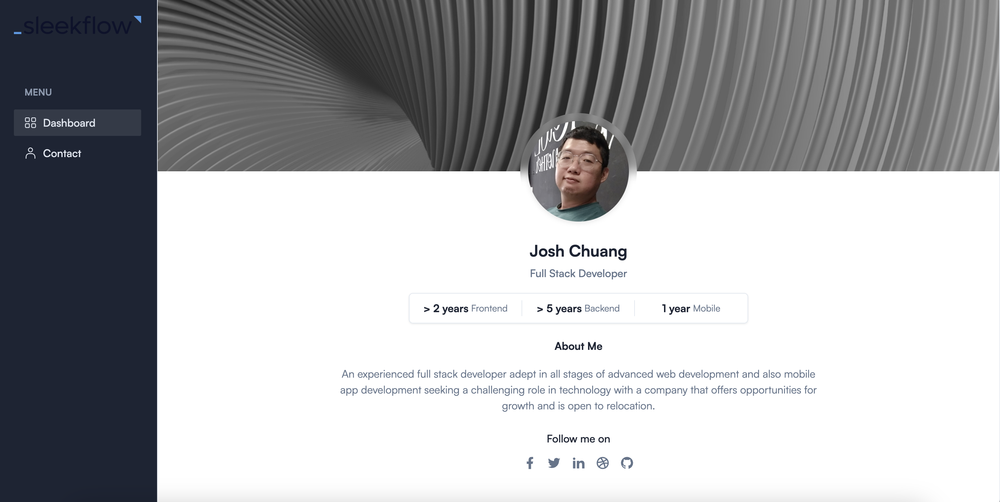

# Sle\_\_F\_\_\_'s Technical Assessment Task 02

I would like to express my sincere gratitude for the interview test given. It was an invaluable opportunity that allowed me to showcase my skills and knowledge while also gaining insights into your company

[](https://github.com/kokhowchuang/)

I kindly request the company name to be kept confidential to prevent the next candidates from searching my GitHub and copying my 100% original answers. Thank you for understanding and respecting this request.

## Installation Steps

To start the development server:

```
yarn
yarn run dev
```

You should now be able to access the application at [http://localhost:5173](http://localhost:5173).

**For Production Build**

```
yarn run build
```

Default build output directory: /dist

This command will generate a dist as build folder in the root of your template that you can upload to your server.

---

## Result


The screenshot above indicates a simple contact list feature commonly found in Customer Relationship Management (CRM) applications.

## Requirements Checklist

Product managers play a crucial role in the development process, as they are responsible for defining acceptance requirements and conducting tests before releasing features to users. To successfully complete this task, it is essential to meet the following requirements:

| Given                                       | When                                 | Then                                                                                                                                                             | Status                    |
| ------------------------------------------- | ------------------------------------ | ---------------------------------------------------------------------------------------------------------------------------------------------------------------- | ------------------------- |
| An aside navbar on the left                 | I click on the button Contact        | I should navigate to /contact. And see a list of contacts. And a Search Characters input field, a Status dropdown, a Gender dropdown buttons in the list header. | Done                      |
| A contact list                              | -                                    | I should only see a maximum of 20 contacts.                                                                                                                      | Done                      |
| A search character name input               | I input a search string              | I should see a list of contacts with names that contain the search string.                                                                                       | Done                      |
| A contact list                              | I click on one of the contact cards  | I should navigate to /contact/:id with the character ID as the id.                                                                                               | Done                      |
| A Status dropdown                           | I click on the dropdown              | I should see a dropdown list with radio buttons to choose between alive, dead, unknown.                                                                          | Done without radio button |
| A Gender dropdown                           | I click on the dropdown              | I should see a dropdown list with radio buttons to choose between female, male, genderless, unknown.                                                             | Done without radio button |
| A Status dropdown list                      | I click a radio option (e.g., Alive) | I should see a list of contacts that have the selected status (e.g., alive in this example).                                                                     | Done                      |
| A Gender dropdown list                      | I click a radio option (e.g., Male)  | I should see a list of contacts that have the selected gender (e.g., male in this example).                                                                      | Done                      |
| Any dropdown value is active                | -                                    | I should see a Clear Filters button at the right end.                                                                                                            | Done                      |
| A combination of filters and search string  | -                                    | I should see a list of contacts that meet all the filtering requirements.                                                                                        | Done                      |
| Clear Filters button                        | I click on it                        | It should clear all filter values of Status and Gender.                                                                                                          | Done                      |
| I navigate to a single contact /contact/:id | -                                    | I should see the contact information including a header section with the contact image and name. And a personal info section. And an episode appearance section. | Done                      |
| A personal info section                     | -                                    | I should see information about Status, Gender, Species, Location, Origin, and Created Date of the contact.                                                       | Done                      |
| An episode appearance section               | -                                    | I should see a table listing the Name, Air Date, Episode, and Created Date of each episode.                                                                      | Done                      |
